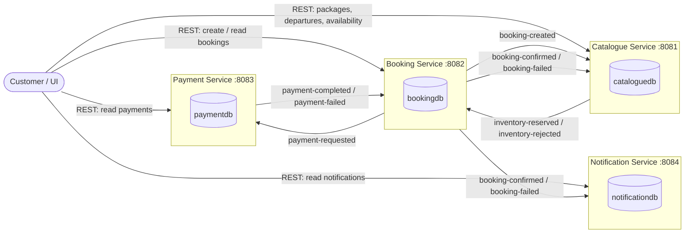
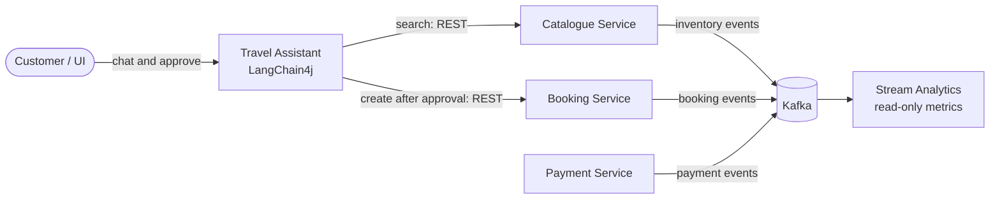

# Technical Architecture

## Microservice Architecture
This application contains four **Microservice Modules** that communicate asynchronously through **Apache Kafka**:
- **Catalogue Service** (`:8081`) — travel packages, package departures, departure capacity and inventory reservations
- **Booking Service** (`:8082`) — booking creation and the booking lifecycle (coordinator of the booking workflow)
- **Payment Service** (`:8083`) — payment processing for bookings (simulated gateway)
- **Notification Service** (`:8084`) — customer notifications for booking outcomes

Supporting infrastructure:
- **Apache Kafka** (`localhost:9092`) — message broker for all inter-service communication



Solid service boundaries represent separate applications and separate databases. Arrows labelled with topic names are asynchronous Kafka messages; only arrows explicitly labelled `REST` are synchronous, and all of those come from the client.

There are **no synchronous REST calls between services**. Every cross-service interaction is an event published to and consumed from Kafka. Each service exposes its own REST API to clients and owns its own database.

## Layered Architecture
Each microservice module is structured into the following layers (one Java package per layer):
1. **Presentation Layer** (`controller`) — `@RestController` classes exposing the REST API
2. **Messaging Layer** (`messaging`) — Spring Cloud Stream `Consumer<Event>` beans that receive Kafka events and `StreamBridge` calls that publish them
3. **Service Layer** (`service`) — `@Service` classes holding the business rules and lifecycle/state transitions
4. **Domain Layer** (`model`, `event`) — JPA `@Entity` classes, status enums, and Java `record` event payloads
5. **Data Access Layer** (`repository`) — Spring Data JPA `JpaRepository` interfaces
6. **Cross-cutting** (`exception`) — `@RestControllerAdvice` global exception handling

## Repository Structure
The project is structured as a set of **independent Maven projects** (there is currently no root aggregator POM; each module has its own Maven wrapper):
- `catalogue-service`: Module for the Catalogue Service
- `booking-service`: Module for the Booking Service
- `payment-service`: Module for the Payment Service
- `notification-service`: Module for the Notification Service
- `specs/`: Specification-first artifacts (this folder)
- `agent_prompt.md`: Prompt instructions for the development agent
- `docs/`: Detailed setup, manual-testing and troubleshooting guide

Each module follows the same internal layout:

```text
<service>/
├── pom.xml
├── mvnw / mvnw.cmd
└── src/
    ├── main/java/com/travelbooking/<service>/
    │   ├── controller/
    │   ├── event/
    │   ├── exception/
    │   ├── messaging/
    │   ├── model/
    │   ├── repository/
    │   └── service/
    ├── main/resources/application.properties
    └── test/java/com/travelbooking/<service>/
```

## Technology Stack
- **JDK & Build**: Java 21, Apache Maven (Maven Wrapper per module)
- **Framework**: Spring Boot 4.1.x
    - **Controller Layer**: `@RestController`, `spring-boot-starter-webmvc`
    - **Service Layer**: `@Service`, `@Transactional`
    - **Domain Layer**: `@Entity` (Jakarta Persistence), Jakarta Validation (`@NotNull`, `@NotBlank`, `@Min`, `@Size`, `@DecimalMin`)
    - **Data Access Layer**: `@Repository` via Spring Data JPA `JpaRepository`
    - **Error Handling**: `@RestControllerAdvice`
- **Messaging**: Spring Cloud Stream 2025.1.x with the Kafka binder (`spring-cloud-stream-binder-kafka`)
    - Consumers are functional `Consumer<T>` beans registered through `spring.cloud.function.definition`
    - Producers use `StreamBridge` with `<binding>-out-0` bindings
    - All payloads are JSON (`content-type=application/json`)
- **Message Broker**: Apache Kafka 4.x (run locally via Docker image `apache/kafka:4.3.1`)
- **Database**: H2 in-memory database, one schema per service (`cataloguedb`, `bookingdb`, `paymentdb`, `notificationdb`), `ddl-auto=create-drop`; H2 console enabled at `/h2-console`
- **Unit & Integration Testing**: JUnit 5, Mockito (`@ExtendWith(MockitoExtension.class)`, `@MockitoBean`), `MockMvc` (`@WebMvcTest`), `@SpringBootTest`

## Kafka Topics

| Topic | Producer | Consumer(s) | Purpose |
| :--- | :--- | :--- | :--- |
| `booking-created` | Booking | Catalogue | Request an inventory reservation for a new booking |
| `inventory-reserved` | Catalogue | Booking | Reservation succeeded; booking may proceed to payment |
| `inventory-rejected` | Catalogue | Booking | Reservation failed; booking fails |
| `payment-requested` | Booking | Payment | Request payment for a booking |
| `payment-completed` | Payment | Booking | Payment succeeded; booking is confirmed |
| `payment-failed` | Payment | Booking | Payment failed; booking fails |
| `booking-confirmed` | Booking | Catalogue, Notification | Confirm the reservation; notify the customer |
| `booking-failed` | Booking | Catalogue, Notification | Release the reservation; notify the customer |

Each consuming service uses its own consumer group (`catalogue-service`, `booking-service`, `payment-service`, `notification-service`) so that both Catalogue and Notification independently receive `booking-confirmed` / `booking-failed`.

## Design Principles
- **Database per service** — services never read or write the tables of another service; data crosses service boundaries only inside events.
- **Event-driven choreography with a coordinating service** — the Booking Service owns the booking state machine (`PENDING_INVENTORY → PENDING_PAYMENT → CONFIRMED | FAILED`) and reacts to events from Catalogue and Payment; Catalogue and Payment own their own local state.
- **Compensation on failure** — a `BookingFailed` event causes the Catalogue Service to release the inventory reservation, restoring capacity (a lightweight saga).
- **Idempotency and out-of-order protection**
    - Catalogue enforces a unique `booking_id` per inventory reservation (`DUPLICATE_BOOKING`).
    - Payment enforces a unique `booking_id` per payment and returns the existing payment on repeated requests.
    - Booking only applies a lifecycle event when the booking is in the expected prior state (e.g. `InventoryReserved` only when `PENDING_INVENTORY`).
- **Capacity derived, not stored** — available capacity is computed as `departure.capacity − Σ quantity of RESERVED/CONFIRMED reservations`, so releases restore capacity automatically.
- **Validation at the boundary** — request bodies are validated with Jakarta Validation and `@Valid`; violations return `400` with a field → message map.
- **Uniform error handling** — every service has a `GlobalExceptionHandler` returning `400` for validation errors and `500` for unexpected errors; missing resources return `404`.
- **Constructor injection** throughout; no field injection.

## Future Considerations
- Add a root multi-module `pom.xml` so all services build and test with one command.
- Introduce separate request/response DTOs instead of exposing JPA entities directly in the REST API.
- Replace the prototype payment rule (`amount > 0` succeeds) with a real payment-gateway integration.
- Deliver notifications through real channels (email/SMS) instead of only persisting them with status `SENT`.
- Add the planned **Customer Service**, **AI / Recommendation Service** and an **API Gateway**.
- Use a persistent database (e.g. PostgreSQL) with schema migrations instead of H2 `create-drop`.
- Add the transactional outbox pattern and dead-letter topics for reliable event publishing and poison-message handling.
- Automatically mark departures `SOLD_OUT` when available capacity reaches zero; implement booking cancellation that releases inventory.
- Remove the `TestController` health endpoint in favour of Spring Boot Actuator.

### Planned supporting components (not yet implemented)

To keep the core model small, the advanced capabilities are intended to sit **outside** the booking transaction:



- The **Travel Assistant** owns no business entities. It may search the catalogue freely but requires explicit human approval before creating a booking through the existing `POST /api/bookings` endpoint.
- **Stream Analytics** consumes the existing Kafka topics and owns only disposable metric projections; it never writes to a service database.
- A separate **Customer Service** is deferred. `customerId` is already carried by Booking, Payment and Notification, so a Customer Service can be added later without changing the core flow.
