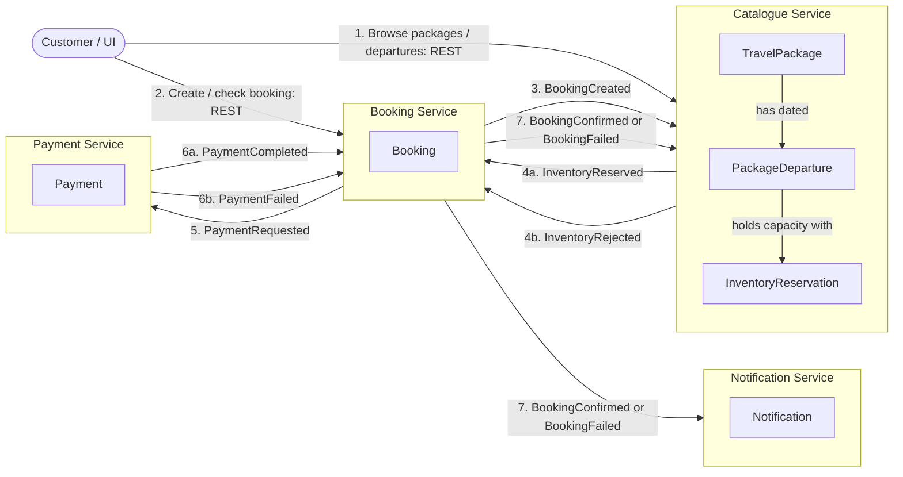
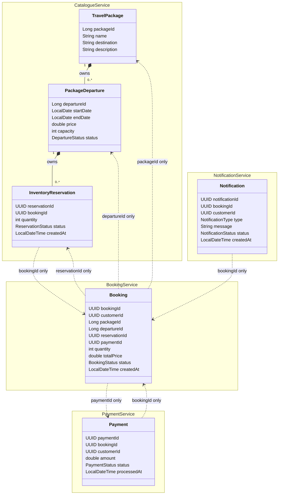
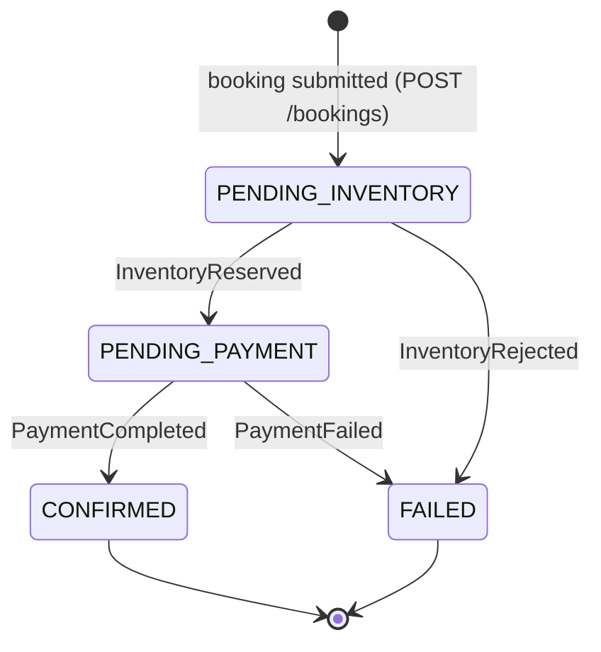

# Domain Models Specification

## 1. Domain Classes and Related User Stories

| Service | User Story | Domain Classes |
| :--- | :--- | :--- |
| **Catalogue Service** | **C1. Create/Get/Update/Delete Travel Package** | `TravelPackage` |
| **Catalogue Service** | **C2. List and Search Packages** | `TravelPackage` |
| **Catalogue Service** | **C3. Manage Package Departures** | `TravelPackage`, `PackageDeparture` |
| **Catalogue Service** | **C4. Check Departure Availability** | `PackageDeparture`, `InventoryReservation` |
| **Catalogue Service** | **C5. Reserve/Confirm/Release Inventory** | `PackageDeparture`, `InventoryReservation`, `ReservationResult` |
| **Booking Service** | **B1. Create a Booking** | `Booking` |
| **Booking Service** | **B2. Get/list Bookings** | `Booking` |
| **Booking Service** | **B3. Delete a Booking** | `Booking` |
| **Booking Service** | **B4. Booking Lifecycle** | `Booking`, `BookingStatus` |
| **Payment Service** | **P1. Process Payment** | `Payment`, `PaymentStatus` |
| **Payment Service** | **P2. View Payments** | `Payment` |
| **Notification Service** | **N1. Notify Customer** | `Notification`, `NotificationType` |
| **Notification Service** | **N2. View Notifications** | `Notification` |

---

## 1.1 Bounded Contexts and Service Interactions

The system has four bounded contexts. Each service owns its entities and its database. Relationships **between** services are identifiers carried in Kafka events, never JPA relationships or database foreign keys.



Solid service boundaries represent separate applications and separate databases. Arrows labelled with event names use Kafka; only arrows explicitly labelled `REST` are synchronous. The Catalogue Service reacts to step 7 by confirming or releasing the reservation locally — it does not publish a further event back to Booking.

## 1.2 Entity References



Solid composition arrows are real JPA `@ManyToOne` associations inside the Catalogue Service. The dotted relationships cross service boundaries and are **ID references only** — they must not be implemented as JPA associations.

---

## 2. Catalogue Service Domain Model

The Catalogue Service manages the travel-package catalogue, scheduled departures and the inventory (capacity) of each departure.

```text
TravelPackage 1 ───── * PackageDeparture 1 ───── * InventoryReservation
```

### 2.1 `TravelPackage`
Represents a holiday product offered by the travel agency.

| Field Name | Type | Description | Constraints / Notes |
| :--- | :--- | :--- | :--- |
| `packageId` | `Long` | Unique package identifier | Primary Identifier, auto-generated (`IDENTITY`) |
| `name` | `String` | Package name | Required (`@NotBlank`), max 100 characters |
| `destination` | `String` | Destination, e.g. "Tokyo, Japan" | Required (`@NotBlank`), max 100 characters; searchable (contains, case-insensitive) |
| `description` | `String` | Marketing description | Required (`@NotBlank`), max 500 characters |

---

### 2.2 `PackageDeparture`
Represents a scheduled departure (an instance of a package on specific dates) with a price and a fixed capacity.

| Field Name | Type | Description | Constraints / Notes |
| :--- | :--- | :--- | :--- |
| `departureId` | `Long` | Unique departure identifier | Primary Identifier, auto-generated (`IDENTITY`) |
| `travelPackage` | `TravelPackage` | Owning package | Required, `@ManyToOne` (lazy), column `package_id`; not serialised in JSON |
| `startDate` | `LocalDate` | Departure start date | Required |
| `endDate` | `LocalDate` | Departure end date | Required |
| `price` | `double` | Price per place | `>= 0.01` |
| `capacity` | `int` | Total places available on the departure | `>= 1` |
| `status` | `DepartureStatus` (Enum) | Status (`AVAILABLE`, `SOLD_OUT`, `CANCELLED`) | Default: `AVAILABLE`; only `AVAILABLE` departures accept reservations |

---

### 2.3 `InventoryReservation`
Represents a hold on `quantity` places of a departure for a specific booking.

| Field Name | Type | Description | Constraints / Notes |
| :--- | :--- | :--- | :--- |
| `reservationId` | `UUID` | Unique reservation identifier | Primary Identifier, auto-generated |
| `bookingId` | `UUID` | ID of the booking (from Booking Service) | Required; **unique** (`uk_inventory_booking`) — one reservation per booking |
| `departure` | `PackageDeparture` | Departure the places are reserved on | Required, `@ManyToOne` (lazy), column `departure_id`; not serialised in JSON |
| `quantity` | `int` | Number of places reserved | `>= 1` |
| `status` | `ReservationStatus` (Enum) | Status (`RESERVED`, `CONFIRMED`, `RELEASED`) | Default: `RESERVED`; `RESERVED` and `CONFIRMED` consume capacity |
| `createdAt` | `LocalDateTime` | Date and time the reservation was created | Set on creation (`@PrePersist`) |

**Derived rule — available capacity**
`availableCapacity(departure) = departure.capacity − Σ reservation.quantity where status ∈ {RESERVED, CONFIRMED}`

---

### 2.4 `ReservationResult` / `ReservationOutcome` (service-layer value objects)
`ReservationResult` is a `record (ReservationOutcome outcome, InventoryReservation reservation)` returned by `InventoryReservationService.reserve(...)`.

| `ReservationOutcome` | Meaning | REST mapping | Event mapping |
| :--- | :--- | :--- | :--- |
| `CREATED` | Reservation saved | `201 Created` | `InventoryReserved` |
| `DEPARTURE_NOT_FOUND` | No departure with that ID | `404 Not Found` | `InventoryRejected` |
| `DEPARTURE_UNAVAILABLE` | Departure status is not `AVAILABLE` | `409 Conflict` | `InventoryRejected` |
| `INSUFFICIENT_CAPACITY` | Requested quantity exceeds available capacity | `409 Conflict` | `InventoryRejected` |
| `DUPLICATE_BOOKING` | A reservation for this booking already exists | `409 Conflict` | `InventoryRejected` |

---

## 3. Booking Service Domain Model

The Booking Service manages customer bookings and coordinates the booking lifecycle across Catalogue and Payment through events.

### 3.1 `Booking`
Represents a request by a customer to book places on a package departure.

| Field Name | Type | Description | Constraints / Notes |
| :--- | :--- | :--- | :--- |
| `bookingId` | `UUID` | Unique booking identifier | Primary Identifier, auto-generated |
| `customerId` | `UUID` | ID of the booking customer | Required |
| `packageId` | `Long` | Reference to the Catalogue `TravelPackage` | Required (reference by ID only — no cross-service join) |
| `departureId` | `Long` | Reference to the Catalogue `PackageDeparture` | Required |
| `reservationId` | `UUID` | Reference to the Catalogue `InventoryReservation` | Null until `InventoryReserved` is received |
| `paymentId` | `UUID` | Reference to the Payment Service `Payment` | Null until `PaymentCompleted` / `PaymentFailed` is received |
| `quantity` | `int` | Number of places requested | `>= 1` |
| `totalPrice` | `double` | Total amount to be paid | Provided by client; forwarded as the payment amount |
| `status` | `BookingStatus` (Enum) | Status (`PENDING_INVENTORY`, `PENDING_PAYMENT`, `CONFIRMED`, `FAILED`) | Default: `PENDING_INVENTORY`; changed only by events |
| `createdAt` | `LocalDateTime` | Date and time the booking was created | Set on creation (`@PrePersist`) |

**State machine**



Cancellation, refunds, reservation expiry, multiple itinerary items and payment retries are intentionally excluded from the first working version.

| Current status | Event | Next status | Side effect |
| :--- | :--- | :--- | :--- |
| `PENDING_INVENTORY` | `InventoryReserved` | `PENDING_PAYMENT` | set `reservationId`; publish `PaymentRequested` |
| `PENDING_INVENTORY` | `InventoryRejected` | `FAILED` | — |
| `PENDING_PAYMENT` | `PaymentCompleted` | `CONFIRMED` | set `paymentId`; publish `BookingConfirmed` |
| `PENDING_PAYMENT` | `PaymentFailed` | `FAILED` | set `paymentId`; publish `BookingFailed` |
| any other combination | — | unchanged | event ignored |

---

## 4. Payment Service Domain Model

The Payment Service records one payment per booking and simulates an external payment gateway.

### 4.1 `Payment`

| Field Name | Type | Description | Constraints / Notes |
| :--- | :--- | :--- | :--- |
| `paymentId` | `UUID` | Unique payment identifier | Primary Identifier, auto-generated |
| `bookingId` | `UUID` | Booking the payment is for | Required; **unique** — one payment per booking (idempotent processing) |
| `customerId` | `UUID` | Paying customer | Required |
| `amount` | `double` | Amount charged | Taken from `PaymentRequested.amount` |
| `status` | `PaymentStatus` (Enum) | Status (`PENDING`, `COMPLETED`, `FAILED`) | Default: `PENDING` |
| `processedAt` | `LocalDateTime` | Date and time the payment was processed | Null until processed |

**Prototype gateway rule**: `amount > 0` → `COMPLETED`; `amount <= 0` → `FAILED` (reason *"Payment amount must be greater than zero"*).

---

## 5. Notification Service Domain Model

The Notification Service stores customer-facing messages generated from booking outcomes.

### 5.1 `Notification`

| Field Name | Type | Description | Constraints / Notes |
| :--- | :--- | :--- | :--- |
| `notificationId` | `UUID` | Unique notification identifier | Primary Identifier, auto-generated |
| `bookingId` | `UUID` | Booking the notification relates to | Required |
| `customerId` | `UUID` | Recipient customer | Required |
| `type` | `NotificationType` (Enum) | Type (`BOOKING_CONFIRMED`, `BOOKING_FAILED`) | Set from the triggering event |
| `message` | `String` | Human-readable message | e.g. "Your booking has been confirmed." |
| `status` | `NotificationStatus` (Enum) | Status (`CREATED`, `SENT`) | Default: `CREATED`; set to `SENT` when generated from an event |
| `createdAt` | `LocalDateTime` | Date and time the notification was created | Set on creation (`@PrePersist`) |

---

## 6. Domain Events (Kafka message contracts)

Events are immutable Java `record`s serialised as JSON. Each service keeps its own copy of the records it produces or consumes; the field names and types below are the shared contract.

| Event | Topic | Producer → Consumer(s) | Fields |
| :--- | :--- | :--- | :--- |
| `BookingCreatedEvent` | `booking-created` | Booking → Catalogue | `bookingId: UUID`, `customerId: UUID`, `packageId: Long`, `departureId: Long`, `quantity: int`, `totalPrice: double` |
| `InventoryReservedEvent` | `inventory-reserved` | Catalogue → Booking | `bookingId: UUID`, `reservationId: UUID`, `departureId: Long`, `quantity: int` |
| `InventoryRejectedEvent` | `inventory-rejected` | Catalogue → Booking | `bookingId: UUID`, `departureId: Long`, `reason: String` (a `ReservationOutcome` name) |
| `PaymentRequestedEvent` | `payment-requested` | Booking → Payment | `bookingId: UUID`, `customerId: UUID`, `amount: double` |
| `PaymentCompletedEvent` | `payment-completed` | Payment → Booking | `bookingId: UUID`, `paymentId: UUID` |
| `PaymentFailedEvent` | `payment-failed` | Payment → Booking | `bookingId: UUID`, `paymentId: UUID`, `reason: String` |
| `BookingConfirmedEvent` | `booking-confirmed` | Booking → Catalogue, Notification | `bookingId: UUID`, `customerId: UUID`, `reservationId: UUID` |
| `BookingFailedEvent` | `booking-failed` | Booking → Catalogue, Notification | `bookingId: UUID`, `customerId: UUID`, `reservationId: UUID` (may be null), `reason: String` |
